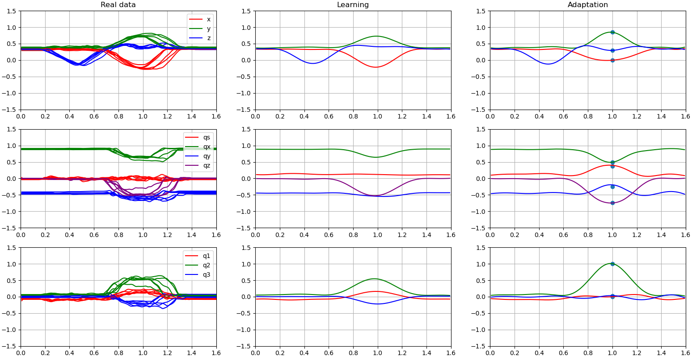

# Kernelized Movement Primitives

This repository contains a Python implementation of the Kernelized Movement Primitives 
paper by Huang et al. [[1](#references)].

# Usage

Launch the main.py script with the number of the desired demo (i.e. 1 or 2) as argument.

## Demo 1


The demo implements a GUI for ease of exploration of KMP's capabilities. When first launched, the GUI loads the demonstration database for the letter 'G' (top left plot), then initializes a Gaussian Mixture Model (GMM) on it, with 8 components (top center plot). The starting letter as well as the number of components can be changed by editing the corresponding text boxes in the bottom right and clicking the 'Update' button.

Then a reference trajectory (top right plot) is extracted from the GMM via Gaussian Mixture Regression (GMR), which is then used to initialize two instances of KMP (the two plots on the bottom left).

The two KMP plots are interactive, and new waypoints can be independently inserted by clicking the corresponding point on the plot while holding the CTRL key.

Finally, the superposition of multiple feasible trajectories (bottom right plot) is demonstrated by initializing another KMP instance that mixes the other two according to some priority values. The superposition updates as the other KMP instances are updated.

KMP's parameters are handled differently with respect to the definition in [[1](#references)]. A single estimator matrix is used in the fitting, using the same $\lambda$ value for both the mean and covariance optimization sub-problems. Furthermore, the $\frac{\mathcal N}{\lambda_c}$ value in the prediction is replaced by an $\alpha$ parameter. This results in a faster fitting (one less matrix inverse to compute), as well as in a simplification of the parameter selection step.

## Demo 2



The demo implements orientation learning with KMP [[2](#references)]. The code loads a set of demonstrations recorded on an UR5e manipulator and extracts the pose data (i.e. xyz coordinates and axis-angle representations of the orientations). For the positions, a KMP pipeline similar to that of demo 1 is implemented (top row). The orientations are converted to quaternions (middle row), which are then projected in Euclidean space (bottom row) and used to train a KMP model. The model is then used to show both learning, i.e. emulating the original reference trajectory, and adaptation, i.e. adapting towards a new desired quaternion.

## Demo 3


The demo implements time-driven trajectory learning with KMP. The code loads the dataset for the letter 'G', including velocities, then trains KMP on it (left plot). Adaptation is showcased both in position (second and third plots from the left) and in velocity (fourth and fifth plots).

The main conceptual difference between demo 3 and demo 1 lies in the construction of the kernel matrix. For demo 1, since no velocities were considered, the kernel matrix is of the form:

$$
k(s_1,s_2) = e^{-\sigma_f\mid\mid s_1-s_2\mid\mid}\mathbb I_\mathcal O
$$

where $\mathbb I_\mathcal O$ is the $\mathcal O$-dimensional identity matrix and $\mathcal O$ is the number of output features. In this demo, exploiting the information on trajectory dynamics, the full kernel matrix described in [[1](#references)] is used.

# References

#### [1] KMP: learning and adaptation. 
[[Link to publication]](https://www.researchgate.net/publication/319349682_Kernelized_Movement_Primitives)
```
@Article{Huang19IJRR,
  Title = {Kernelized Movement Primitives},
  Author = {Huang, Y. and Rozo, L. and Silv\'erio, J. and Caldwell, D. G.},
  Journal = {International Journal of Robotics Research},
  Year = {2019},
  Volume={38},
  Number={7},
  Pages = {833--852},
}
```

#### [2] KMP: learning orientations.
[[Link to publication]](https://www.researchgate.net/publication/330675655_Generalized_Orientation_Learning_in_Robot_Task_Space)
```
@InProceedings{Huang19ICRA_2,
   Title = {Generalized Orientation Learning in Robot Task Space},
   Author = {Huang, Y. and Abu-Dakka, F. and Silv\'erio, J. and Caldwell, D. G.},
   Booktitle = {Proc. {IEEE} International Conference on Robotics and Automation ({ICRA})},　　　　
   Year = {2019},
   Address = {Montreal, Canada},
   Month = {May},
   Pages = {2531--2537}
 }
```